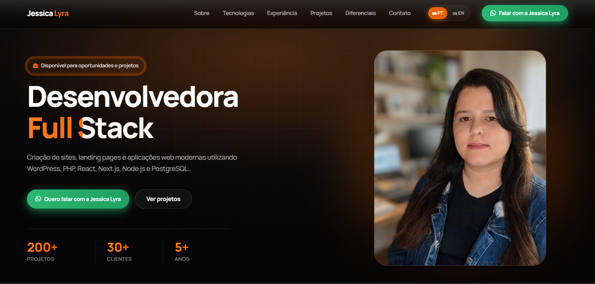

# 👋 Olá, eu sou Jessica Lyra

Desenvolvedora Web | WordPress • React • Next.js • TypeScript

Este repositório contém o código-fonte do meu portfólio profissional.

🌐 **Portfólio:** https://jessicalyra.github.io/

---

## Preview

---

## Sobre

Meu portfólio reúne projetos profissionais, projetos pessoais e minha trajetória como Desenvolvedora Web, demonstrando minha evolução técnica e experiência com diferentes tecnologias.

---

## Tecnologias

### Front-end
- HTML5
- CSS3
- JavaScript
- React
- Next.js
- TypeScript
- Tailwind CSS

### Back-end
- Node.js
- Prisma ORM
- PostgreSQL
- JWT
- bcrypt

### WordPress
- WordPress
- Elementor
- PHP

### Ferramentas
- Git
- GitHub
- Vercel
- VS Code

---

## Funcionalidades

- ✅ Portfólio responsivo
- ✅ Projetos profissionais
- ✅ Projetos pessoais
- ✅ Versão em português
- ✅ Versão em inglês
- ✅ Demonstrações em vídeo
- ✅ Links para projetos publicados

---

## Contato

- 🌐 Portfólio: https://jessicalyra.github.io/
- 💼 LinkedIn: https://www.linkedin.com/in/jessica-lyra-dev/
